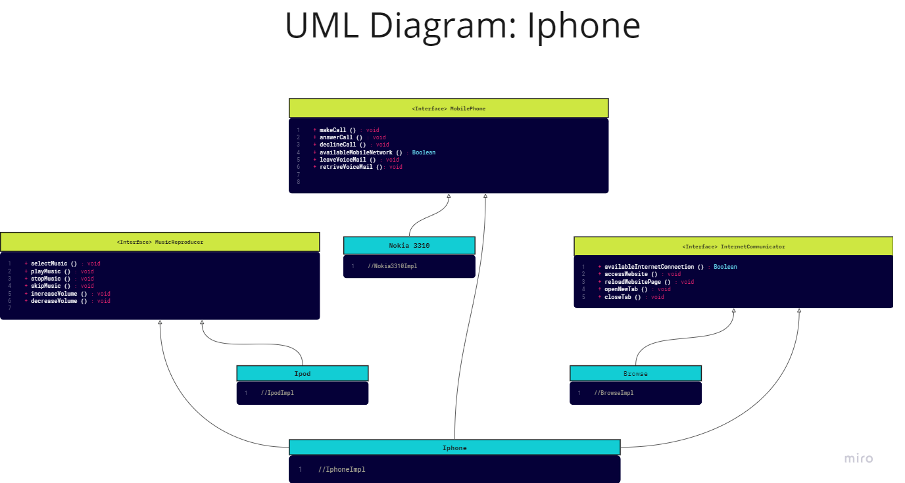

# Desafio Controle de Fluxo

Projeto criado para relizar o desafio proposto pelo Instrutor Gleyson Sampaio de elaborar um diagrama UML  
para representação e implementacao das classes e interfacesde de um componente Iphone 
no Desafio de Projeto: Orientação a Objetos e UML: Diagramação de Classes do iPhone  
disponibilizado pelo Santander Bootcamp 2023 - Backend Java na plataforma da DIO.

## Diagrama UML: Componente Iphone

## Stacks utilizadas

## Aprendizados
- Diagramação de classes e interfaces com UML
- Aplicação de Orientação a Objetos com a linguagem Java
- Criação de classes
- Criação de interfaces
- Implementação de interfaces

## Melhorias futuras
- Ajustar os pacotes para o padrao da Arquitetura Hexagonal
- Aplicar testes unitarios
- Aplicar Padrões de projetos

## Referência

- [Descrição do desafio proposto](https://github.com/digitalinnovationone/trilha-java-basico/tree/main/desafios/poo)
- [Interface - Java Básico](https://glysns.gitbook.io/java-basico/programacao-orientada-a-objetos/interface)
- [Miro: ferramenta utilizada para criação UML](https://miro.com/pt/)

